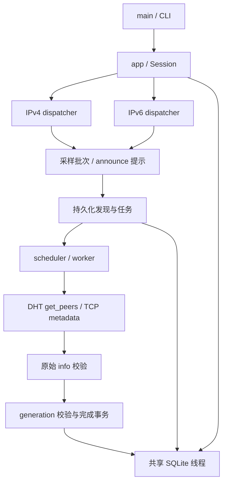

# 系统架构

bt-sniffer 是单 binary crate 的 BitTorrent DHT 发现与原始 metadata 采集程序。它保存 v1／v2 完整身份和校验后的原始 info 字节，并为本地保存结果建立可重建的只读搜索目录；不下载文件内容，也不获取 piece layers 或提供 torrent 导出；v2 支持限于 info 身份与目录。

源码入口：[main](../../src/main.rs)、[应用组装](../../src/app/mod.rs)、[采集](../../src/collection/mod.rs)。验证入口：`app::tests` 与 `collection::tests`；执行方式见[验证指南](../development/validation.md)。

## 数据流

每个 dispatcher 独占该地址族的路由、transaction 和 socket，通过 handle 接收命令。双栈共享流量预算、采集器及数据库线程。DHT 可以独立运行；采样和 metadata 获取是分别启用的能力，启用关系见[运行参数](../operations/running.md)。

发现 hash 不等于接纳任务，领取任务不等于开始 TCP，下载成功不等于事务提交。采集状态的事实保存在 SQLite，只有当前领取的完成事务生效才记提交成功。详细状态和代价约束分别由[采集](../domains/collection.md)、[存储](../domains/storage.md)维护。

## 运行与边界

Tokio 使用 `current_thread`。网络协作通过有界通道和异步任务推进；阻塞 SQLite 操作只在专用线程执行。日志另有后台 writer。异步任务、数据库命令和进程各自需要完成确认，不能把取消通知解释为全部资源已经释放，见[生命周期](lifecycle.md)。

应用直接组装具体类型，业务模块持有自己的策略和 SQL，底层存储只管理执行及资源。这样降低单应用的抽象和 API 维护成本，代价是替换存储或独立复用某个业务模块需要显式重构。只有真实需求出现时才重访这些边界；性能决策需用实际瓶颈证据支持，不能从单线程配置推导吞吐结论。

修改归属、依赖方向和测试位置见[源码目录设计](repository-layout.md)；此处不重复各领域参数和状态表。

## 发现流程可视化

启用监控时，业务向 observation 发布关联事件并独立维护当前状态。monitor 汇合 DHT 只读快照和 CollectionStore 查询，通过本机 HTTP/SSE 输出；不参与调度决定。SQLite 保持持久业务事实，内存过程随进程结束丢失。协议和资源限制见[观测接口](../domains/monitoring.md)。
