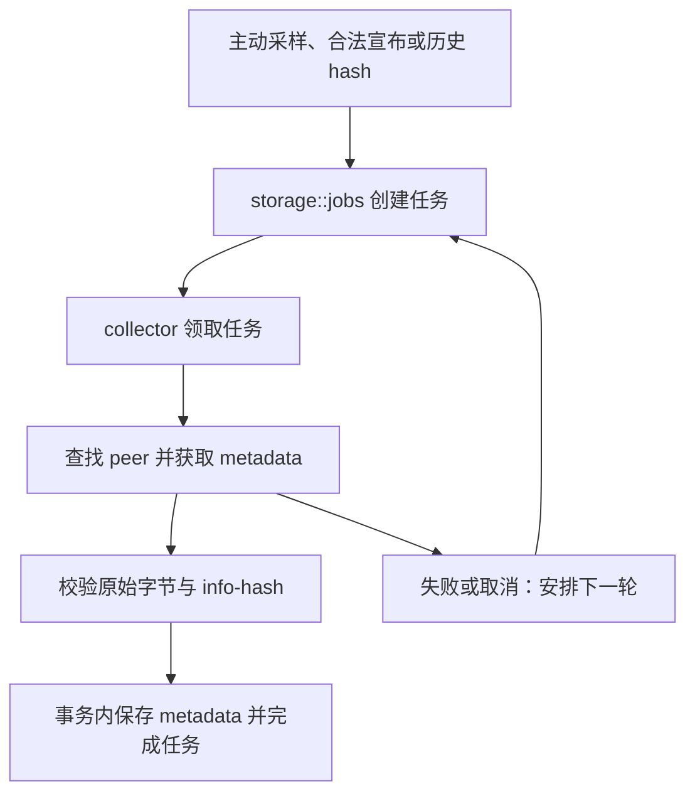
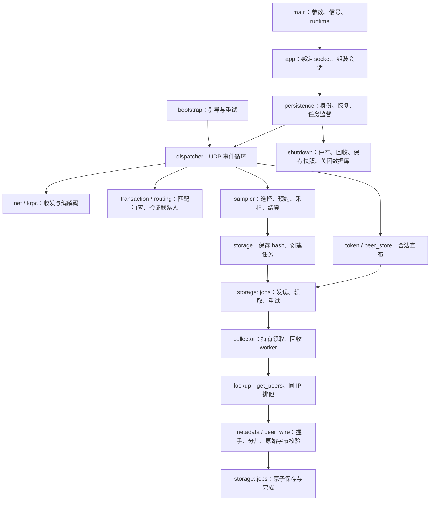

# 从一个任务测试开始

这份指南假定你已经会写变量、函数和基本结构体。你会先运行真实项目测试，再理解它用到的所有权、错误处理和异步机制。运行参数与部署边界见 [README](../README.md)，编写代码时参考 [Rust 开发约束](rust-development.md)。

## 1. 先认识要跟踪的流程

本程序发现 BitTorrent 的 info-hash（内容摘要标识），寻找提供 metadata 的 peer，验证收到的原始 info 字典，然后保存到 SQLite。它不下载文件内容。



先关注任务如何领取和恢复；网络细节在第 5 步再读。

## 2. 动手运行一个测试

在仓库根目录打开 [任务测试](../src/storage/jobs/tests.rs)，找到 `dedup_capacity_recovery_and_stale_generation`，运行：

```sh
cargo test --locked storage::jobs::tests::dedup_capacity_recovery_and_stale_generation -- --exact
```

第一次运行需要已安装的 Rust 工具链和项目依赖，Cargo 可能下载依赖并编译。当前项目使用 edition 2024，未声明最低 Rust 版本；若工具链不满足依赖要求，先处理 Cargo 给出的版本错误。

这个测试自身只使用临时目录和 SQLite，不发现公网节点，不下载 metadata，也不读写你的运行状态目录。依赖已缓存时可以添加 `--offline`。

预期输出包含：

```text
test storage::jobs::tests::dedup_capacity_recovery_and_stale_generation ... ok
test result: ok. 1 passed; 0 failed;
```

尾部的过滤数量与耗时会随代码和机器变化。必须看到目标测试名和 `1 passed`，仅看到命令退出成功不足以证明选中了测试。

## 3. 观察，再解释

按下面的顺序阅读同一个测试：

| 测试动作 | 应观察到的结果 | 原因 |
| --- | --- | --- |
| `enable_fetch(1)`，发现 `[first_hash, first_hash, second_hash]` | 只有一个活跃任务 | 重复 hash 去重，并受容量限制 |
| `claim_job(100)` | 返回首次领取；再领一次为空 | 同一任务不能同时被再次领取 |
| `recover_jobs(200)` 后重新领取 | 第二次 generation 更大 | 恢复使旧领取失效 |
| 用首次领取提交失败 | 新任务仍是 running | 旧 worker 的迟到结果被忽略 |
| 当前领取反复失败 | 最终休眠，另一个 hash 可以进入 | 退避和休眠控制重试与容量 |

接着打开 [任务实现](../src/storage/jobs/mod.rs)，依次阅读 `claim_job`、`retry_job` 和 `recover_jobs`。测试中的整数时间是 UTC 毫秒，用于安排数据库里的期限；实际采集通过注入的 `Clock` 取得时间，不依靠等待真实分钟来测试退避。

这里先掌握三个 Rust 机制：

- `Result<Option<Job>, StorageError>` 有三种结果：`Ok(Some(job))` 领到任务，`Ok(None)` 暂时没有任务，`Err(error)` 存储失败。`?` 将错误交给调用者处理，`let … else` 处理正常的缺失。
- `claim_job` 返回拥有数据的 `Job`。把它交给重试或完成函数会转移所有权；测试里的旧领取与新领取是两份不同的数据，generation 用于判断哪份仍有效。
- `.await` 等待数据库线程回复，等待期间 Tokio 可以运行其他任务。它不表示在异步运行时线程里直接执行 SQLite。

测试使用 `unwrap()` 是为了在预期不成立时立即失败；业务代码用 `Result` 保留可恢复错误。

## 4. 修改一次，再验证

只修改这个测试中的 `store.enable_fetch(1)`，把 `1` 改为 `2`，重新运行第 2 步的同一命令。

预期这次测试失败，失败位置是活跃任务数量的断言：实际值为 `2`，预期值为 `1`。原因是两个不同 hash 现在都能被接纳；重复出现的 first_hash 仍不会创建第三个任务。

把参数恢复为 `1`，再次运行，确认目标测试重新通过。不要修改生产并发配置，也不要为了让实验通过而删除断言。

完成标准：你能解释为什么容量为 2 时得到两个任务，以及为什么旧 generation 不能改变重新领取的任务。

## 5. 沿着调用链继续读

这时再展开完整链路。图中的箭头表示调用或数据传递，不表示每个方框都有一个独立线程。



| 阅读位置 | 本步需要回答的问题 |
| --- | --- |
| [main](../src/main.rs) → [config](../src/config.rs) → [app](../src/app/mod.rs) | 参数什么时候生效？谁创建 runtime 和 socket？启动失败后谁回收已创建的资源？ |
| [bootstrap](../src/app/bootstrap/mod.rs) → [身份](../src/identity.rs) → [恢复](../src/dht/dispatcher/recovery.rs) | 引导与磁盘联系人有什么不同？为什么恢复联系人仍要验证？ |
| [UDP](../src/net/udp/mod.rs) → [KRPC](../src/krpc/mod.rs) → [事件循环](../src/dht/dispatcher/runtime/mod.rs) | 谁检查字节、谁检查业务字段、谁决定下一次唤醒？ |
| [transaction](../src/dht/transaction/mod.rs) → [response](../src/dht/dispatcher/response.rs) → [routing](../src/dht/routing/mod.rs) | 为什么先登记再发包？为什么第三方响应不能消耗在途请求？ |
| [token](../src/dht/token/mod.rs) → [peer 查询](../src/dht/dispatcher/peer_queries/mod.rs) | 收到 announce 为什么还不能立即写入？成功 ACK 是否代表采集任务已经落盘？ |
| [sampler](../src/dht/dispatcher/sampler/mod.rs) → [durable](../src/dht/dispatcher/sampler/durable/mod.rs) | 输出许可、磁盘预约、真正发包分别发生在何时？旧会话确认如何收尾？ |
| [collector](../src/collector/mod.rs) → [lookup](../src/collector/lookup.rs) | Job 与 worker 谁持有？没有种子和查询后没有 peer 为什么不同？ |
| [metadata 会话](../src/metadata/session/mod.rs) → [peer-wire](../src/peer_wire/mod.rs) | 扩展 ID 为什么有两个方向？无关消息为什么不能刷新分片期限？ |
| [任务完成](../src/storage/jobs/mod.rs) → [数据库线程](../src/storage/mod.rs) | 如何防止旧 generation 落库？调用者取消时，命令和预算归谁？ |
| [persistence](../src/persistence/mod.rs) 的 `shutdown_inner` | 为什么先回收采集器，再关闭节点，最后关闭数据库？超时后错误保存在哪里？ |

每次只读一行对应的链路，先尝试回答右栏问题，再运行下面的真实测试。已有的协议注释保留 BEP 名称；不用先背完整协议。

读存储边界时，对照以下说明：

- `FnOnce` 表示闭包最多调用一次，允许消费捕获的数据；`move` 将需要保留的数据捕获进闭包。
- `Send` 允许将操作跨线程转移；`'static` 要求不携带可能提前失效的借用，不表示任务必须永久存在。
- `dyn` 统一不同闭包的类型，`Box` 让它们能放入同一个命令队列。这里先理解接口，不需要自行实现闭包分发。
- `oneshot` 只返回一次结果。取消等待接收端，不会撤销已进入数据库队列的命令。
- 有界队列限制命令条数，许可另外限制载荷字节。许可随命令持有到处理结束，不能因调用者取消而提前释放。

继续核对三个关键契约：`Deferred` 不增加失败次数；`complete_job` 忽略旧领取时也返回 `Ok(())`，但不写入数据；发送取消通知之后仍需要回收任务、处理结果和确认数据库关闭。

## 6. 跑通从采样到入库

打开 [collector 测试](../src/collector/tests.rs)，运行：

```sh
cargo test --locked collector::tests::sample_to_metadata_v4 -- --exact
```

预期目标测试显示 `ok` 和 `1 passed`。它在 loopback 模拟 UDP 节点与 TCP peer，用临时 SQLite 验证采样、get_peers、下载、原始字节保存及重启后不重复领取。测试会显式回收模拟 peer 和会话；不启动公网采集。

顺着 `sample_to_metadata_v4` → `sample_or_history` → `await_metadata` 阅读。`Fixture` 中的 `session` 拥有资源，`handle` 用来发送控制命令；`DiscoverySource` 决定 hash 从哪里进入。

动手：只把 `sample_to_metadata_v4` 调用中的 `DiscoverySource::Sampling` 改为 `DiscoverySource::History`，再次运行同一命令。预期仍通过：辅助函数改为先保存历史 hash，并跳过主动采样启动，下游领取、下载和落库保持相同。观察两个分支后恢复为 `Sampling`，再次运行。

完成标准：能说明“发现入口不同”为什么不需要复制一套下载逻辑。继续进入第 7 步理解下载成功的门槛。

## 7. 验证原始字节，不能只看传输完成

打开 [metadata 测试](../src/metadata/tests.rs)，运行：

```sh
cargo test --locked metadata::tests::final_verification_rejects_untrusted_metadata -- --exact
```

预期 `1 passed`，表示三个非法输入均被拒绝：hash 不符、根不是字典、字典后有尾随字节。模拟 peer 的标准握手会声明目标 hash，后续仍必须独立检查收到的正文。

动手：只将该测试输入表中的第一项

```rust
(b"de".to_vec(), InfoHashV1([0; 20]))
```

改为

```rust
(b"de".to_vec(), hash(b"de"))
```

重新运行，预期在 `unwrap_err()` 处失败：`de` 是完整的空字典，现在摘要也一致，因此实际得到成功结果。恢复原输入，再运行，确认通过。对照会话的 `verify_metadata`，理解它为什么先校验原始字节，再检查字典边界，最后才移出缓冲区。

完成标准：能区分“握手宣称的 hash”“正文计算出的 hash”和“正文是完整字典”。接着看第 8 步，确认已保存数据和运行资源如何分开收尾。

## 8. 关闭后，再打开同一个目录

打开 [app 测试](../src/app/tests.rs)，运行：

```sh
cargo test --locked app::tests::graceful_shutdown_releases_state_directory -- --exact
```

预期 `1 passed`。测试连续启动并关闭应用，检查数据库仍存在、正常关闭后的 WAL/SHM 已释放，最后重新打开数据库。清理完成由任务返回、文件状态和重新打开共同证明。

动手：只把该测试的 `for _ in 0..2` 改为 `0..3`，再次运行，预期仍通过。恢复为两轮，再验证一次。对照 `shutdown_inner`：采集器还需要 dispatcher 取消查询，收尾还需要数据库保存结果，因此关闭顺序不能随意交换。

完成标准：能解释为什么 `Drop` 或发出取消信号不能代替显式等待 `shutdown()`，以及为什么正常关闭不应删除已保存的数据库。

## 9. 验证自己的修改

只改任务逻辑时，先运行：

```sh
cargo test --locked storage::jobs::tests::
```

涉及命令、取消或关闭边界时，再运行相应的 `storage::tests::`、`collector::tests::`、`persistence::tests::`。后两组包含本机 socket 测试；环境禁止创建 socket 时，记录阻塞，不能把它当作通过。

提交改动供审查前执行 [README 的验证命令](../README.md#验证)。内部文档可用以下命令生成：

```sh
cargo doc --locked --no-deps --document-private-items
```

这是文档构建，不是内部代码片段的 doctest。示例行为以实际测试为证。性能优化的证据要求见 [Rust 开发约束](rust-development.md#性能取舍)；不要把测试通过理解为已经测量了性能。
